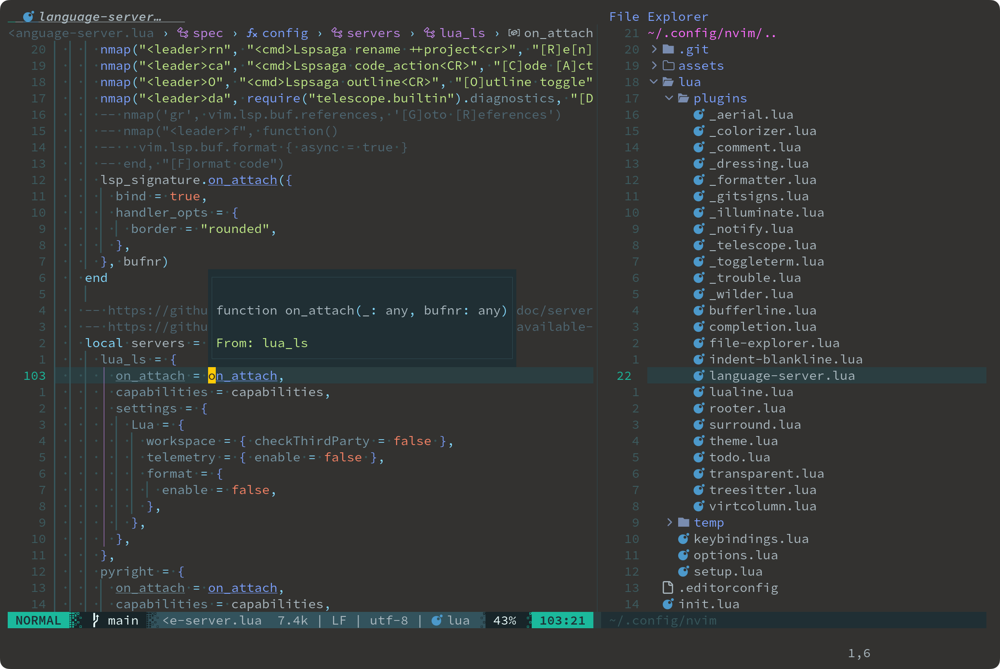

create wezterm color schemes config file:

```
touch ~/.config/wezterm/wezterm_color_schemes.lua
```

and write following content:
```lua
return {
  {
    name = "Hopscotch",
    background = "dark",
  },
  {
    name = "Zenburn",
    background = "dark",
  },
  {
    name = "ToyChest",
    background = "dark",
  },
  {
    name = "FishTank",
    background = "dark",
  },
  {
    name = "Gruvbox dark, pale (base16)",
    background = "dark",
  },
  {
    name = "Atelier Savanna (base16)",
    background = "dark",
  },
  {
    name = "seoulbones_dark",
    background = "dark",
  },
  {
    name = "Everforest Dark (Gogh)",
    background = "dark",
  },
  {
    name = "Vs Code Light+ (Gogh)",
    background = "light",
  },
}
```
